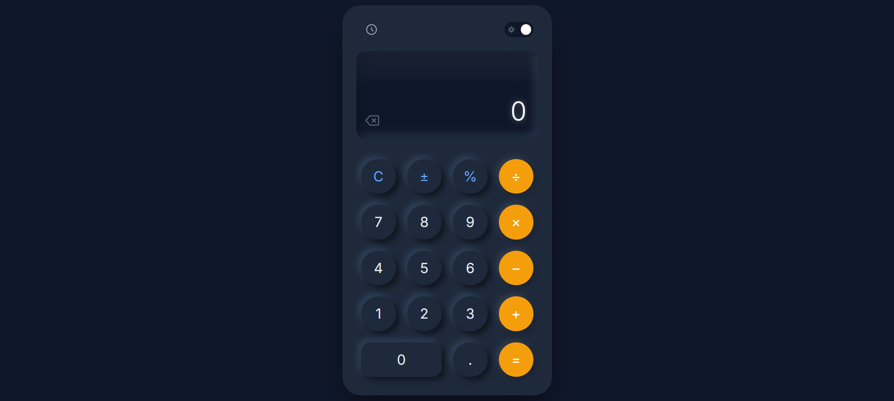

# Modern Premium Calculator

[](https://warunaslfi.github.io/vanilla-js-calculator/)

A professional, high-fidelity Calculator web application built with vanilla HTML, CSS, and JavaScript. Featuring a **Neumorphic design**, **Glassmorphism history panel**, and a dedicated focus on premium user experience improvements like visual feedback and smart scrolling.



## Features

- **Premium UI**: Neumorphic soft-touch buttons, realistic screen with inner shadows and glare.
- **Smart Display**: Auto-scrolling for long numbers with `tabular-nums` for precise alignment.
- **Copy to Clipboard**: Click the display screen to instantly copy the result.
- **Visual Feedback**: Buttons physically animate and light up when typing on your keyboard.
- **Core Operations**: Addition, Subtraction, Multiplication, Division (seamless operator switching supported).
- **Advanced Functions**: Percentage (%), Toggle Sign (±), Clear (C), Backspace (⌫).
- **History**: View last 10 calculations in a glassmorphic side panel; click to reuse results.
- **Theme Support**: Professional Light and "Deep Slate" Dark mode.
- **Validation**: Handles errors (e.g., divide by zero) gracefully.

## Keyboard Shortcuts

| Key | Action |
|:---:|:---|
| `0` - `9` | Enter numbers |
| `.` | Decimal point |
| `+`, `-`, `*`, `/` | Operations |
| `Enter` or `=` | Calculate result |
| `Backspace` | Delete last digit |
| `Escape` | Clear all (C) |
| `%` | Percentage |

## How to Run

1. **Clone or Download** the repository.
2. Open `index.html` in any modern web browser.
3. Enjoy!

## Project Structure

```
├── index.html      # Main structure
├── style.css       # Premium Styling (CSS Variables, Flexbox/Grid)
├── script.js       # Logic, Event Listeners, Calculator Class
└── README.md       # Documentation
```

## Technologies

- **HTML5**: Semantic structure.
- **CSS3**: Advanced variables, Grid, Glassmorphism, Neumorphism.
- **JavaScript (ES6+)**: Class-based architecture.
- **Fonts**: 'Inter' (Professional UI Standard).
